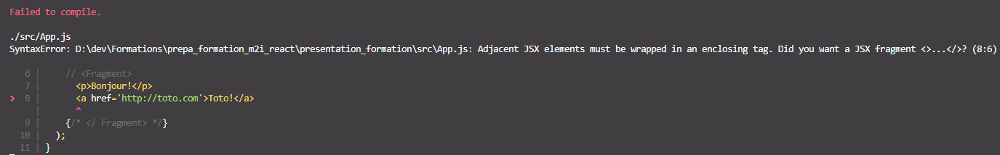

# JSX

## Présentation

JSX signifie JavaScript XML.

Pour créer des components React, il faut utiliser la structure suivante:

```js
let texte = React.createElement('p', {}, 'texte d\'exemple');
let noeud = document.getElementById('root');
render(texte, noeud)
```

Ce qui donne sur une simple liste:
```js
let nav = React.createElement("ul", {}, 
  React.createElement('li', null, 'element1'),
  React.createElement('li', null, 'element2'));

  let noeud = document.getElementById('root')

render(nav, noeud)
```

Cette écriture peut être largement simplifiée en utilisant le JSX:
```jsx
      <ul>
        <li>element1</li>
        <li>element2</li>
      </ul>
```

Pour utiliser la puissance de React, il ne faut pas modifier le fichier index.js (sauf motif valable!)


## Les balises

### Auto-fermantes

Toutes les balises HTML sont reconnues nativement par React, qui permet de les utiliser de manière indifférente en jsx
Une différence cependant :

LES BALISES AUTO-FERMANTES DOIVENT ETRE IMPERATIVEMENT FERMEES!

Exemple:
```jsx
const mauvais = <div>
const ok = <div />
```

### Racine

En JSX, il ne peut y avoir qu'une seule balise racine

**Erreur :**
```jsx
<h1>Hello</h1>
<p>World</p>
```

Cette écriture lèvera une erreur de la part de react:


**Valide :**
```jsx
<div>
    <h1>Hello</h1>
    <p>World</p>
</div>
```

#### Fragment

Cette balise a été créée par l'équipe React; elle permet d'englober les autres plus "proprement";
```jsx
<Fragment>
    <p>Hello</p>
    <p>World</p>
</Fragment>
```
La balise Fragment a le même effet qu'une div, à ceci près qu'elle ne sera pas rendue dans le HTML final.
Il n'est pas possible de lui attribuer une classe par exemple.

L'écriture de la balise Fragment peut être raccourcie:
```jsx
<>
    <p>Hello</p>
    <p>World</p>
</>
```

### Les balises personnalisées

Ce sont des balises de composants React qui s'appellent sous la forme
```jsx
<NomDeLaClasseComposant />
```