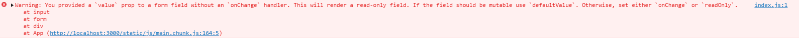

# Les composants contrôlés

Il s'agit des composants qui reçoivent des valeurs du parent

Si nous contrôlons un composant qui a un état local:
```jsx
import './App.css';
import React from 'react'


const App = () => {
    const [nom, setNom] = useState("Timio")

    return (
      <div className="App">
        <form>
          <label>Nom</label>
          <input name='nom' type='text' value={nom} />
          <button type='submit'>OK</button>
        </form>
      </div>
    );
}

export default App;
```
Nous aurons cette erreur qui apparaîtra dans la console:

et le champ ne sera pas modifiable.

Le fait d'utiliser 
```jsx
defaultValue
```

à la place de 
```jsx
value
```
permet de conserver le champ modifiable

Cependant, afin de récupérer cette valeur, il est indispensable de passer la fonction du parent qui permet de le modifier dans le state:

```jsx
import './App.css';
import React from 'react'


const App = () => {


  const handleChangeNom = (event) => {
    this.setState({
      nom: event.target.value
    })
  }

    return (
      <div className="App">
        <form>
          <label>Nom</label>
          <input name='nom' type='text' value={nom} onChange={(event) => handleChangeNom(event)}/>
          <button type='submit'>OK</button>
        </form>
      </div>
    );
}

export default App;
```

Ainsi, le champ est modifiable, nous n'avons plus d'erreur dans la console et l'on peut voir que la valeur du champ est bien stockée dans le state:


