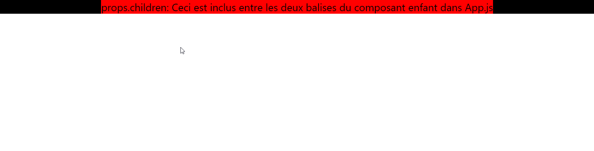

# Les props children

Il s'agit d'éléments passés entre deux balises du composant.

Si l'on considère que A est le composant parent et B le composant enfant,

```jsx
const A = () => {
    <B>ceci sera inclus dans props.children</B>
}
```

en prenant un exemple concret:

**Dans App.js:**
```jsx
import './App.css';
import { ComposantAfficheur } from './components/ComposantAfficheur';


function App() {
  return (
    <div className="App">
      <ComposantAfficheur>Ceci est inclus entre les deux balises du composant enfant dans App.js</ComposantAfficheur>
    </div>
  );
}

export default App;
```

**Dans App.css:**
```css
.App {
  display: flex;
  justify-content: center;
  background-color: black
}
```

**Dans ComposantAfficheur.jsx:**
```jsx
import React from 'react'

export const ComposantAfficheur = (props) => {
    return (
        <div style={{backgroundColor:"red", width:"fit-content"}}>
            props.children: {props.children}
        </div>
    )
}
```

Cela nous donnera le rendu suivant:


Il est également possible de passer directement le paramètre "children" dans le component:
```jsx
function ComposantAfficheur(children) {}
```

## Passage d'expressions JS

Toutes les expressions JS peuvent être passées en tant que children:
**Ternaire:**
```jsx
import './App.css';
import { ComposantAfficheur } from './components/ComposantAfficheur';


function App() {
    const val = 3;
    return (
        <div className="App">
        <ComposantAfficheur>{val > 1 ? <span>Supérieur</span> : <span>Inférieur</span>} </ComposantAfficheur>
        </div>
    );
}

export default App;
```

**Fonction:**
```jsx
import './App.css';
import { ComposantAfficheur } from './components/ComposantAfficheur';


function App() {
    function afficheOK() {
        return "OK"
    }
    return (
        <div className="App">
        <ComposantAfficheur>{afficheOK()} </ComposantAfficheur>
        </div>
    );
}

export default App;
```

**Callback:**
(à placer directement dans index.js -> pour le test)
```jsx
import React from 'react'
import { render } from 'react-dom'

function Repeat(props) {
  let items = [];
  for (let i =0; i<props.numTimes; i++) {
      items.push(props.children(i));
  }
  return <div>{items}</div>
}
function ListOfTenThings() {
  return (
      <Repeat numTimes={10}>
          {(index) => <div key={index}>This is item {index} in the list</div>}
      </Repeat>
  )
}
render(ListOfTenThings(), document.getElementById('root'));
```

## Elements n'affichant rien

```jsx
<div />
<div>{false}</div>
<div>{null}</div>
<div>{undefined}</div>
<div>{true}</div>
```

Ces éléments n'affichent rien, mais false, true, null et undefined sont des éléments valides et peuvent donc être récupérés via props.children